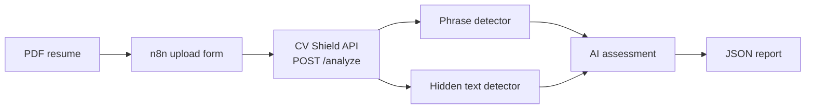

# CV Shield

CV Shield is a Python-based tool for analyzing PDF resumes and detecting suspicious content that may attempt to manipulate AI-powered recruitment systems.

The project was created as a portfolio project focused on Python, AI, automation, and document analysis.

## The Problem

As recruitment processes increasingly use AI to analyze resumes, documents can potentially contain hidden or manipulative instructions designed to influence automated systems.

Examples include instructions attempting to:

- Override previous instructions
- Influence hiring recommendations
- Automatically approve a resume
- Bypass manual review
- Manipulate technical evaluations

CV Shield was created to identify this type of content and provide evidence for human review.

## What CV Shield Does

CV Shield analyzes a PDF resume using three layers of detection:

1. **Suspicious pattern detector**: extracts the text and checks it against a list of known manipulative phrases.
2. **Hidden text detector**: inspects each text fragment's font size, color and position (not just its content) and flags font sizes below 3pt, near-white text (RGB and CMYK) and text positioned outside the visible page. It can catch hidden instructions even when they avoid every known phrase, because it looks at how the text is rendered rather than what it says.
3. **AI-assisted analysis**: sends the text and the findings of the two detectors to an LLM (Groq's free API), which returns a risk level (`none`, `low`, `medium`, `high`), a short explanation and a recommended next step. It is skipped when there are no findings, to avoid unnecessary API calls.

**Important:** CV Shield does not make hiring decisions. It only identifies potential evidence for human review.

## How It Works



The command line script and the API share the same function (`analyze_pdf` in `src/main.py`), so the analysis logic exists in one place only.

## Quick Start

```powershell
pip install -r requirements.txt
Copy-Item .env.example .env
python -m uvicorn src.api:app --reload
```

Then set `GROQ_API_KEY` in the `.env` file (it is ignored by Git and must never be committed) and open `http://127.0.0.1:8000/docs` to try the API from the browser.

## API

| Method | Path       | Description                                                              |
|--------|------------|--------------------------------------------------------------------------|
| GET    | `/health`  | Simple check that the API is running                                     |
| POST   | `/analyze` | Receives a PDF (`multipart/form-data`, field `file`) and returns the report |

The report contains the findings and the AI assessment, but not the full resume text. Uploads are validated before the analysis: files above 5 MB are rejected (413), files without the PDF signature or that cannot be parsed are rejected (400), and the temporary copy of the file is deleted right after the analysis.

## n8n Integration

An exported n8n workflow (`n8n/cv-shield-analyze-resume.json`) provides an upload form that sends the PDF to the API and shows the report. Setup details are in [docs/n8n.md](docs/n8n.md).

## Tests

The suite has 35 tests (one of them is a documented expected failure). The AI integration and the API endpoints are tested with mocks, so the suite never depends on network access or API quota.

```powershell
python -m unittest discover -s tests
```

The tests use fictional resumes covering instruction overrides, hiring manipulation, patterns split across lines, hidden text (tiny, near-white and off-page), a paraphrased attempt that only the structural detector catches, and a legitimate resume with white text on a colored sidebar (a known false positive, described below).

## Known Limitations & Lessons Learned

While testing against real PDF output (not just literal strings in unit tests), we found that `pypdf` extraction inserts line breaks exactly where the PDF renders a visual line break. A suspicious phrase spanning two lines in the PDF (e.g. "...passed with \nfull score") would not match a pattern written as a single-line string, since a substring comparison treats `\n` and a space as different characters.

This was fixed by normalizing whitespace (collapsing line breaks and repeated spaces into a single space) before pattern matching, and covered with a regression test built from real extracted PDF text rather than hand-written strings.

This also surfaced a deeper limitation: the phrase-based detector relies on matching a fixed list of known strings, so a paraphrased instruction avoiding those exact phrases will not be caught. This was addressed by adding a second, structural detector that inspects font size, color and position directly, independent of wording. It successfully catches a paraphrased test case that the phrase-based detector misses.

The structural detector introduces its own known limitation: it assumes the page background is white, so it only reasons about the text's own color, not what is behind it. A legitimate resume using white text on a colored sidebar (a common design pattern, demonstrated in `examples/test_colored_band_resume.pdf`) is currently flagged as a false positive. This is documented with a dedicated test marked `@expectedFailure`, so the suite records the limitation without treating it as a regression. Fixing this would require tracking background fills and rectangles drawn behind text, which is left for a future iteration.

We also found that `pypdf`'s reported text coordinates differed between versions (5.9.0 vs. 6.19.0) when testing the same PDF, which could silently change hidden-text detection results. The `pypdf` version is now pinned in `requirements.txt` to the version the detector was built and tested against.

For the AI-assisted analysis, we initially tried the Anthropic API, but it requires a paid plan beyond a small initial credit. We switched to Groq, which offers a genuinely free tier (rate-limited, no credit card required). Groq's available model catalog differs from what its own documentation lists and can change over time, so the model name is confirmed by querying `client.models.list()` against the actual account rather than hardcoding a name from documentation alone.

While preparing the API, we found that `requirements.txt` listed only `pypdf`, even though the project already imported `groq` and `python-dotenv` since the AI step. A fresh clone would have failed on import. All direct dependencies are now listed with pinned versions.

To make the pipeline reusable, the analysis logic was moved out of `main()` into a function that returns the report (`analyze_pdf`). The command-line script and the API both call it, instead of each keeping its own copy.

While building the n8n workflow, n8n's file access restrictions and the way it names binary fields caused two non-obvious errors. Replacing the file-reading node with an upload form avoided the first one and made the workflow easier to use (details in [docs/n8n.md](docs/n8n.md)).

When running the API tests, Starlette prints a deprecation warning saying that using `httpx` with its test client is deprecated and that `httpx2` should be installed instead. The tests pass with the pinned `httpx` version, so this is not blocking, but it is worth revisiting when the dependencies are next updated.

## Privacy Note

When the detectors find something, the resume text is sent to the Groq API for the AI assessment. Use fictional or anonymized resumes unless you are comfortable with that.

## Tech Stack

- Python
- pypdf (version pinned in `requirements.txt`)
- unittest
- FastAPI and uvicorn (HTTP API)
- Git & GitHub
- Groq API (free tier) for AI-assisted analysis
- n8n (workflow automation, runs locally)

## Development Roadmap

- [x] **Step 1: Project definition and initial setup**
- [x] **Step 2: Environment setup and basic PDF text extraction**
- [x] **Step 3: Initial suspicious-pattern detector**
- [x] **Step 4: Structured scan report generation**
- [x] **Step 5: JSON output and automated testing**
- [x] **Step 6: Hidden-text detection and PDF structure analysis**
- [x] **Step 7: AI-assisted analysis of suspicious instructions**
- [x] **Step 8: n8n integration and workflow automation**
- [ ] **Step 9: Expanded testing and validation**

## Status

🚧 **Work in progress**

CV Shield is being developed incrementally, with new detection rules, tests, experiments, and improvements added throughout the project.

## Ethical Considerations

All test resumes used in this project are fictional.

CV Shield is designed to support human review, not to make hiring decisions or determine whether a candidate should be hired or rejected.