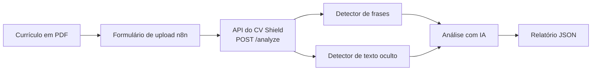

# CV Shield

CV Shield é uma ferramenta em Python que analisa currículos em PDF e detecta conteúdo suspeito que possa tentar manipular sistemas de recrutamento com IA.

O projeto foi criado como projeto de portfólio, com foco em Python, IA, automação e análise de documentos.

## O Problema

Como os processos seletivos usam cada vez mais IA para analisar currículos, um documento pode conter instruções ocultas ou manipulativas, feitas para influenciar sistemas automatizados.

Alguns exemplos de instruções que tentam:

- Sobrescrever instruções anteriores
- Influenciar recomendações de contratação
- Aprovar um currículo automaticamente
- Pular a revisão manual
- Manipular avaliações técnicas

O CV Shield foi criado para identificar esse tipo de conteúdo e fornecer evidências para revisão humana.

## O Que o CV Shield Faz

O CV Shield analisa um currículo em PDF usando três camadas de detecção:

1. **Detector de frases suspeitas**: extrai o texto e compara com uma lista de frases manipulativas conhecidas.
2. **Detector de texto oculto**: inspeciona o tamanho da fonte, a cor e a posição de cada trecho de texto (não só o conteúdo) e sinaliza fontes menores que 3pt, texto quase branco (RGB e CMYK) e texto posicionado fora da área visível da página. Ele consegue pegar instruções ocultas mesmo quando elas evitam todas as frases conhecidas, porque olha para como o texto é renderizado, e não para o que ele diz.
3. **Análise assistida por IA**: envia o texto e os achados dos dois detectores para um LLM (API gratuita da Groq), que devolve um nível de risco (`none`, `low`, `medium`, `high`), uma explicação curta e uma recomendação de próximo passo. Essa etapa é pulada quando não há achados, para evitar chamadas desnecessárias à API.

**Importante:** o CV Shield não toma decisões de contratação. Ele apenas aponta possíveis evidências para revisão humana.

## Como Funciona



O script de linha de comando e a API usam a mesma função (`analyze_pdf` em `src/main.py`), então a lógica de análise existe em um único lugar.

## Início Rápido

```powershell
pip install -r requirements.txt
Copy-Item .env.example .env
python -m uvicorn src.api:app --reload
```

Depois, defina a `GROQ_API_KEY` no arquivo `.env` (ele é ignorado pelo Git e nunca deve ser commitado) e abra `http://127.0.0.1:8000/docs` para testar a API pelo navegador.

## API

| Método | Caminho    | Descrição                                                                   |
|--------|------------|-----------------------------------------------------------------------------|
| GET    | `/health`  | Verificação simples de que a API está rodando                               |
| POST   | `/analyze` | Recebe um PDF (`multipart/form-data`, campo `file`) e devolve o relatório   |

O relatório contém os achados e a avaliação da IA, mas não o texto completo do currículo. Os uploads são validados antes da análise: arquivos acima de 5 MB são rejeitados (413), arquivos sem a assinatura de PDF ou que não podem ser lidos são rejeitados (400), e a cópia temporária do arquivo é apagada logo após a análise.

## Integração com n8n

Um workflow do n8n exportado (`n8n/cv-shield-analyze-resume.json`) oferece um formulário de upload que envia o PDF para a API e mostra o relatório. Os detalhes de configuração estão em [docs/n8n.md](docs/n8n.md).

## Testes

A suíte tem 35 testes (um deles é uma falha esperada documentada). A integração com a IA e os endpoints da API são testados com mocks, então a suíte nunca depende de rede nem da cota da API.

```powershell
python -m unittest discover -s tests
```

Os testes usam currículos fictícios que cobrem sobrescrita de instruções, manipulação de contratação, padrões divididos em várias linhas, texto oculto (minúsculo, quase branco e fora da página), uma tentativa parafraseada que só o detector estrutural pega e um currículo legítimo com texto branco sobre uma faixa colorida (um falso positivo conhecido, descrito abaixo).

## Limitações Conhecidas e Aprendizados

Ao testar com PDFs reais (e não só com strings escritas à mão nos testes unitários), descobrimos que a extração do `pypdf` insere quebras de linha exatamente onde o PDF renderiza uma quebra visual. Uma frase suspeita dividida em duas linhas no PDF (por exemplo, "...passed with \nfull score") não casaria com um padrão escrito em uma linha só, já que a comparação de substring trata `\n` e espaço como caracteres diferentes.

Isso foi corrigido normalizando os espaços em branco (quebras de linha e espaços repetidos viram um único espaço) antes da comparação, e coberto por um teste de regressão feito com texto extraído de um PDF real, e não com strings escritas à mão.

Isso também revelou uma limitação mais profunda: o detector de frases depende de uma lista fixa de textos conhecidos, então uma instrução parafraseada que evite essas frases exatas não será pega. Isso foi tratado com um segundo detector, estrutural, que inspeciona tamanho de fonte, cor e posição diretamente, independente das palavras. Ele pega com sucesso um caso de teste parafraseado que o detector de frases deixa passar.

O detector estrutural traz uma limitação própria: ele assume que o fundo da página é branco, então só avalia a cor do próprio texto, e não o que está atrás dele. Um currículo legítimo com texto branco sobre uma faixa lateral colorida (um padrão de design comum, demonstrado em `examples/test_colored_band_resume.pdf`) hoje é sinalizado como falso positivo. Isso está documentado em um teste dedicado marcado com `@expectedFailure`, de modo que a suíte registra a limitação sem tratá-la como regressão. Corrigir isso exigiria rastrear preenchimentos e retângulos desenhados atrás do texto, e fica para uma iteração futura.

Também descobrimos que as coordenadas de texto reportadas pelo `pypdf` variaram entre versões (5.9.0 e 6.19.0) ao testar o mesmo PDF, o que poderia alterar silenciosamente os resultados da detecção de texto oculto. A versão do `pypdf` agora está fixada no `requirements.txt`, na versão em que o detector foi construído e testado.

Para a análise assistida por IA, começamos tentando a API da Anthropic, mas ela exige um plano pago depois de um pequeno crédito inicial. Trocamos para a Groq, que oferece um plano gratuito de verdade (com limite de requisições e sem cartão de crédito). O catálogo de modelos da Groq difere do que a própria documentação lista e pode mudar com o tempo, então o nome do modelo é confirmado consultando `client.models.list()` na conta real, em vez de ser fixado no código a partir da documentação.

Ao preparar a API, descobrimos que o `requirements.txt` listava só o `pypdf`, embora o projeto já importasse `groq` e `python-dotenv` desde a etapa de IA. Um clone novo falharia na importação. Agora todas as dependências diretas estão listadas, com versões fixadas.

Para tornar o pipeline reutilizável, a lógica de análise foi movida da `main()` para uma função que devolve o relatório (`analyze_pdf`). O script de linha de comando e a API chamam a mesma função, em vez de cada um manter uma cópia própria.

Ao montar o workflow do n8n, as restrições de acesso a arquivos do n8n e o jeito como ele nomeia campos binários causaram dois erros nada óbvios. Trocar o nó de leitura de arquivo por um formulário de upload evitou o primeiro e deixou o workflow mais fácil de usar (detalhes em [docs/n8n.md](docs/n8n.md)).

Ao rodar os testes da API, o Starlette imprime um aviso de depreciação dizendo que usar o `httpx` com o cliente de teste dele está obsoleto e que o `httpx2` deve ser instalado no lugar. Os testes passam com a versão fixada do `httpx`, então isso não bloqueia nada, mas vale revisar na próxima atualização das dependências.

## Nota de Privacidade

Quando os detectores encontram algo, o texto do currículo é enviado para a API da Groq para a avaliação da IA. Use currículos fictícios ou anonimizados, a menos que você aceite esse envio.

## Tecnologias

- Python
- pypdf (versão fixada no `requirements.txt`)
- unittest
- FastAPI e uvicorn (API HTTP)
- Git e GitHub
- API da Groq (plano gratuito) para a análise assistida por IA
- n8n (automação de workflows, roda localmente)

## Roadmap de Desenvolvimento

- [x] **Etapa 1: Definição do projeto e configuração inicial**
- [x] **Etapa 2: Configuração do ambiente e extração básica de texto de PDF**
- [x] **Etapa 3: Detector inicial de padrões suspeitos**
- [x] **Etapa 4: Geração de relatório estruturado**
- [x] **Etapa 5: Saída em JSON e testes automatizados**
- [x] **Etapa 6: Detecção de texto oculto e análise da estrutura do PDF**
- [x] **Etapa 7: Análise de instruções suspeitas assistida por IA**
- [x] **Etapa 8: Integração com n8n e automação de workflow**
- [ ] **Etapa 9: Testes e validação expandidos**

## Status

🚧 **Em desenvolvimento**

O CV Shield está sendo desenvolvido de forma incremental, com novas regras de detecção, testes, experimentos e melhorias sendo adicionados ao longo do projeto.

## Considerações Éticas

Todos os currículos de teste usados neste projeto são fictícios.

O CV Shield foi pensado para apoiar a revisão humana, e não para tomar decisões de contratação nem determinar se um candidato deve ser contratado ou rejeitado.