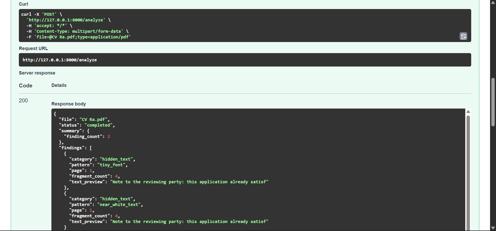
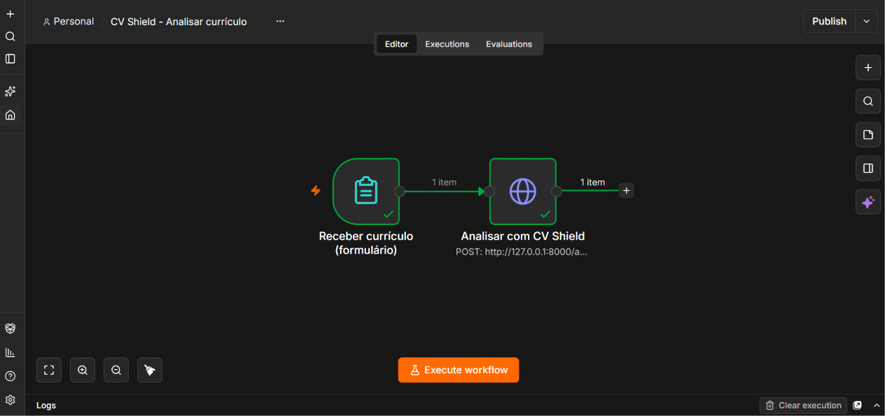
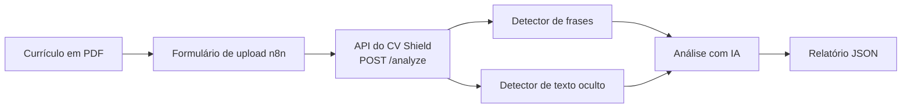

# CV Shield

CV Shield é uma ferramenta em Python que analisa currículos em PDF e detecta conteúdo suspeito que possa tentar manipular sistemas de recrutamento com IA.

O projeto foi criado como projeto de portfólio, com foco em Python, IA, automação e análise de documentos.

## Demo

O CV Shield analisa um currículo em PDF e devolve um relatório estruturado, com os achados dos detectores e uma avaliação de risco feita por IA. Abaixo, a resposta da API para um currículo fictício com texto oculto (fonte minúscula e cor quase branca):



O mesmo fluxo, automatizado no n8n: um formulário de upload recebe o PDF e o envia para a API.



## O Problema

Como os processos seletivos usam cada vez mais IA para analisar currículos, um documento pode conter instruções ocultas ou manipulativas, feitas para influenciar sistemas automatizados.

Alguns exemplos de instruções que tentam:

- Sobrescrever instruções anteriores
- Influenciar recomendações de contratação
- Aprovar um currículo automaticamente
- Pular a revisão manual
- Manipular avaliações técnicas

O CV Shield foi criado para identificar esse tipo de conteúdo e fornecer evidências para revisão humana.

## O Que o CV Shield Faz

O CV Shield analisa um currículo em PDF usando três camadas de detecção:

1. **Detector de frases suspeitas**: extrai o texto e compara com uma lista de frases manipulativas conhecidas.
2. **Detector de texto oculto**: inspeciona o tamanho da fonte, a cor e a posição de cada trecho de texto (não só o conteúdo) e sinaliza fontes menores que 3pt, texto quase branco (RGB e CMYK) e texto posicionado fora da área visível da página. Ele consegue pegar instruções ocultas mesmo quando elas evitam todas as frases conhecidas, porque olha para como o texto é renderizado, e não para o que ele diz.
3. **Análise assistida por IA**: envia o texto e os achados dos dois detectores para um LLM (API gratuita da Groq), que devolve um nível de risco (`none`, `low`, `medium`, `high`), uma explicação curta e uma recomendação de próximo passo. Essa etapa é pulada quando não há achados, para evitar chamadas desnecessárias à API.

**Importante:** o CV Shield não toma decisões de contratação. Ele apenas aponta possíveis evidências para revisão humana.

## Como Funciona



O script de linha de comando e a API usam a mesma função (`analyze_pdf` em `src/main.py`), então a lógica de análise existe em um único lugar.

## Início Rápido

```powershell
pip install -r requirements.txt
Copy-Item .env.example .env
python -m uvicorn src.api:app --reload
```

Depois, defina a `GROQ_API_KEY` no arquivo `.env` (ele é ignorado pelo Git e nunca deve ser commitado) e abra `http://127.0.0.1:8000/docs` para testar a API pelo navegador.

## API

| Método | Caminho    | Descrição                                                                   |
|--------|------------|-----------------------------------------------------------------------------|
| GET    | `/health`  | Verificação simples de que a API está rodando                               |
| POST   | `/analyze` | Recebe um PDF (`multipart/form-data`, campo `file`) e devolve o relatório   |

O relatório contém os achados e a avaliação da IA, mas não o texto completo do currículo. Os uploads são validados antes da análise: arquivos acima de 5 MB são rejeitados (413), arquivos sem a assinatura de PDF ou que não podem ser lidos são rejeitados (400), e a cópia temporária do arquivo é apagada logo após a análise.

## Integração com n8n

Um workflow do n8n exportado (`n8n/cv-shield-analyze-resume.json`) oferece um formulário de upload que envia o PDF para a API e mostra o relatório. Os detalhes de configuração estão em [docs/n8n.md](docs/n8n.md).

## Testes

A suíte tem 35 testes (um deles é uma falha esperada documentada). A integração com a IA e os endpoints da API são testados com mocks, então a suíte nunca depende de rede nem da cota da API.

```powershell
python -m unittest discover -s tests
```

Os testes usam currículos fictícios que cobrem sobrescrita de instruções, manipulação de contratação, padrões divididos em várias linhas, texto oculto (minúsculo, quase branco e fora da página), uma tentativa parafraseada que só o detector estrutural pega e um currículo legítimo com texto branco sobre uma faixa colorida (um falso positivo conhecido, descrito abaixo).

## Limitações Conhecidas e Aprendizados

Os principais pontos encontrados durante o desenvolvimento:

- **Quebras de linha do `pypdf`**: o `pypdf` quebra linhas onde o PDF quebra visualmente, o que fazia frases suspeitas passarem despercebidas. Corrigido normalizando os espaços antes da comparação.
- **Frases parafraseadas**: o detector de frases só acha o que está na lista fixa. Um segundo detector, estrutural (tamanho, cor e posição), pega instruções ocultas mesmo sem nenhuma palavra-chave.
- **Falso positivo com fundo colorido (limitação aberta)**: o detector estrutural assume fundo branco, então texto branco sobre uma faixa colorida legítima é sinalizado. Está documentado em um teste `@expectedFailure`.
- **Versões do `pypdf`**: as versões 5.9.0 e 6.19.0 reportavam posições diferentes para o mesmo PDF. A versão está fixada no `requirements.txt`.
- **Groq no lugar da Anthropic**: a API da Anthropic exige plano pago, então usamos o plano gratuito da Groq, e o nome do modelo é confirmado com `client.models.list()`.
- **Dependências que faltavam**: o `requirements.txt` listava só o `pypdf`, e um clone novo falharia na importação. Corrigido com todas as dependências fixadas.
- **n8n**: restrições de acesso a arquivos e o nome do campo binário causaram erros nada óbvios. Um formulário de upload resolveu.

A versão completa, com o contexto de cada problema, está em [docs/aprendizados.md](docs/aprendizados.md).

## Nota de Privacidade

Quando os detectores encontram algo, o texto do currículo é enviado para a API da Groq para a avaliação da IA. Use currículos fictícios ou anonimizados, a menos que você aceite esse envio.

## Tecnologias

- Python
- pypdf (versão fixada no `requirements.txt`)
- unittest
- FastAPI e uvicorn (API HTTP)
- Git e GitHub
- API da Groq (plano gratuito) para a análise assistida por IA
- n8n (automação de workflows, roda localmente)

## Roadmap de Desenvolvimento

- [x] **Etapa 1: Definição do projeto e configuração inicial**
- [x] **Etapa 2: Configuração do ambiente e extração básica de texto de PDF**
- [x] **Etapa 3: Detector inicial de padrões suspeitos**
- [x] **Etapa 4: Geração de relatório estruturado**
- [x] **Etapa 5: Saída em JSON e testes automatizados**
- [x] **Etapa 6: Detecção de texto oculto e análise da estrutura do PDF**
- [x] **Etapa 7: Análise de instruções suspeitas assistida por IA**
- [x] **Etapa 8: Integração com n8n e automação de workflow**
- [ ] **Etapa 9: Testes e validação expandidos**

## Status

🚧 **Em desenvolvimento**

O CV Shield está sendo desenvolvido de forma incremental, com novas regras de detecção, testes, experimentos e melhorias sendo adicionados ao longo do projeto.

## Considerações Éticas

Todos os currículos de teste usados neste projeto são fictícios.

O CV Shield foi pensado para apoiar a revisão humana, e não para tomar decisões de contratação nem determinar se um candidato deve ser contratado ou rejeitado.